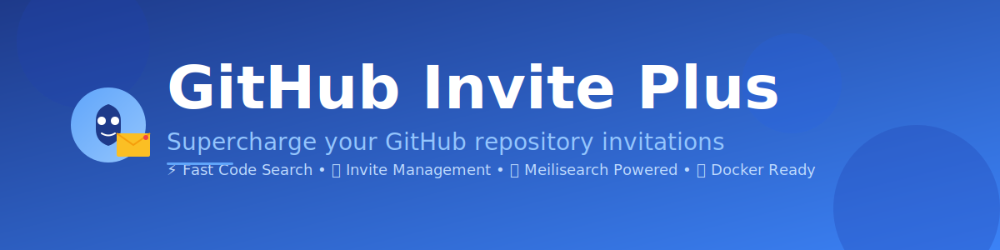

<div align="center">



# GitHub Invite Plus

[](https://github.com/yourusername/github-invite-plus/releases/tag/v1.0.0)
[](LICENSE)
[](https://www.typescriptlang.org/)
[](docker/)
[](https://nodejs.org/)
[](https://www.meilisearch.com/)

**Supercharge your GitHub repository invitations with lightning-fast code search**

[Features](#features) • [Quick Start](#quick-start) • [Installation](#installation) • [Docker](#docker-deployment) • [Documentation](#documentation)

</div>

---

## Features

### Invitation Management
- **Smart Tracking**: Monitor all your GitHub repository invitations in one place
- **Quick Actions**: Accept or decline invitations with a single click
- **Auto Refresh**: Automatic polling for new invitations
- **Status History**: Track invitation lifecycle and actions

### Advanced Code Search
- **Lightning Fast**: Powered by Meilisearch for instant search results
- **Branch-Specific**: Search across multiple branches simultaneously
- **Smart Indexing**: Automatic code indexing on push events
- **Syntax Aware**: Understands code structure for better results

### Chrome Extension
- **Seamless Integration**: Native GitHub UI integration
- **OAuth Authentication**: Secure GitHub App authentication
- **Real-time Updates**: Live invitation notifications
- **Search Panel**: Quick access to code search from anywhere

### Security First
- **CSRF Protection**: Protected against cross-site request forgery
- **OAuth 2.0**: Secure GitHub authentication flow
- **Token Encryption**: Encrypted access token storage
- **Rate Limiting**: Built-in API rate limiting

### Developer Experience
- **TypeScript**: Fully typed codebase for better DX
- **Webhook Support**: GitHub webhook integration for auto-indexing
- **Job Queue**: Background processing for intensive operations
- **Health Checks**: Built-in monitoring endpoints

---

## Prerequisites

- **Node.js** 20 or higher
- **pnpm** 8 or higher
- **Meilisearch** (or use Docker)
- **GitHub App** credentials
- **SQLite** (bundled with better-sqlite3)

---

## Quick Start

### Option 1: Docker (Recommended)

```bash
# Clone the repository
git clone https://github.com/yourusername/github-invite-plus.git
cd github-invite-plus

# Configure environment
cd docker
cp .env.example .env
nano .env  # Edit with your values

# Deploy
./deploy.sh

# Access at http://localhost:8787
```

### Option 2: Local Development

```bash
# Clone and install
git clone https://github.com/yourusername/github-invite-plus.git
cd github-invite-plus
pnpm install

# Setup environment
cp apps/server/.env.example apps/server/.env
nano apps/server/.env  # Configure your values

# Start Meilisearch (separate terminal)
docker run -d -p 7700:7700 \
  -e MEILI_MASTER_KEY=your_key \
  getmeili/meilisearch:v1.11

# Run the server
cd apps/server
pnpm dev

# Build the extension
cd extensions/web
pnpm build
```

---

## Installation

### 1. Clone the Repository

```bash
git clone https://github.com/yourusername/github-invite-plus.git
cd github-invite-plus
```

### 2. Install Dependencies

```bash
pnpm install
```

This will install dependencies for:
- Server application
- Chrome extension

### 3. Configure GitHub App

Create a GitHub App at [github.com/settings/apps](https://github.com/settings/apps):

**Required Permissions:**
- Repository permissions:
  - Contents: Read
  - Metadata: Read
- Organization permissions:
  - Members: Read & Write

**Webhook Events:**
- Push
- Repository

**Callback URL:**
```
http://localhost:8787/auth/exchange
```

### 4. Generate Required Secrets

```bash
# Token encryption key
openssl rand -base64 32

# Session secret
openssl rand -base64 32

# Meilisearch master key
openssl rand -base64 32
```

### 5. Configure Environment

Create `apps/server/.env`:

```bash
NODE_ENV=development
PORT=8787
BASE_URL=http://localhost:8787

# GitHub App credentials
GITHUB_APP_CLIENT_ID=your_client_id
GITHUB_APP_CLIENT_SECRET=your_client_secret

# Security keys (generated above)
TOKEN_ENC_KEY_BASE64=your_encryption_key
SESSION_SECRET=your_session_secret

# CORS (use * for development)
CORS_ORIGINS=*

# Meilisearch
MEILI_URL=http://localhost:7700
MEILI_MASTER_KEY=your_meili_master_key

# Extension
EXTENSION_REDIRECT_URI=https://your-extension-id.chromiumapp.org/oauth/callback

# Optional
WEBHOOK_SECRET=your_webhook_secret
DATABASE_PATH=gip.sqlite
```

---

## Running Locally

### Start Meilisearch

```bash
docker run -d -p 7700:7700 \
  -e MEILI_MASTER_KEY=your_key \
  --name meilisearch \
  getmeili/meilisearch:v1.11
```

### Development Mode

```bash
# Terminal 1: Run server in watch mode
cd apps/server
pnpm dev

# Terminal 2: Build extension
cd extensions/web
pnpm build

# For extension development with watch
pnpm run build -- --watch
```

### Production Build

```bash
# Build server
cd apps/server
pnpm build

# Start server
pnpm start

# Build extension
cd extensions/web
pnpm build
```

### Load Chrome Extension

1. Open Chrome and navigate to `chrome://extensions/`
2. Enable "Developer mode"
3. Click "Load unpacked"
4. Select `extensions/web/dist` directory

---

## Docker Deployment

Complete Docker solution with automated deployment.

### Quick Deploy

```bash
cd docker
cp .env.example .env
nano .env  # Configure your environment
./deploy.sh
```

### What's Included

- **Multi-stage build** for optimized images
- **Docker Compose** orchestration
- **Meilisearch** service
- **Persistent volumes** for data
- **Health checks** for both services
- **Automatic restarts**
- **Remote access ready**

### Services

| Service     | Port | Description            |
| ----------- | ---- | ---------------------- |
| Server      | 8787 | Express.js API backend |
| Meilisearch | 7700 | Search engine          |

### Management Commands

```bash
# View logs
docker-compose -f docker/docker-compose.yml logs -f

# Stop services
docker-compose -f docker/docker-compose.yml down

# Restart services
docker-compose -f docker/docker-compose.yml restart

# View status
docker-compose -f docker/docker-compose.yml ps
```

### Remote Access

The Docker deployment is accessible from any network:

**Local Network:**
```
http://<your-local-ip>:8787
```

**Remote/Public:**
```
http://<your-public-ip>:8787
```

**Firewall Configuration:**
```bash
# Allow ports
sudo ufw allow 8787/tcp
sudo ufw allow 7700/tcp
```

### Production Setup

For production, use a reverse proxy with SSL:

```nginx
server {
    listen 443 ssl http2;
    server_name your-domain.com;

    ssl_certificate /path/to/cert.pem;
    ssl_certificate_key /path/to/key.pem;

    location / {
        proxy_pass http://localhost:8787;
        proxy_http_version 1.1;
        proxy_set_header Upgrade $http_upgrade;
        proxy_set_header Connection 'upgrade';
        proxy_set_header Host $host;
        proxy_set_header X-Real-IP $remote_addr;
        proxy_set_header X-Forwarded-For $proxy_add_x_forwarded_for;
        proxy_set_header X-Forwarded-Proto $scheme;
    }
}
```

See [docker/README.md](docker/README.md) for complete documentation.

---

## Architecture

```
┌─────────────────────────────────────────────────────────────┐
│                     Chrome Extension                        │
│  ┌────────────┐  ┌──────────────┐  ┌──────────────────┐  │
│  │  Content   │  │   Service    │  │  OAuth Handler   │  │
│  │  Script    │  │   Worker     │  │                  │  │
│  └────────────┘  └──────────────┘  └──────────────────┘  │
└─────────────────────────────────────────────────────────────┘
                           │
                           │ HTTPS (CORS)
                           ▼
┌─────────────────────────────────────────────────────────────┐
│                   Express.js Server                         │
│  ┌────────────┐  ┌──────────────┐  ┌──────────────────┐  │
│  │   Auth     │  │   API        │  │   Webhooks       │  │
│  │   Routes   │  │   Routes     │  │   Handler        │  │
│  └────────────┘  └──────────────┘  └──────────────────┘  │
│  ┌────────────┐  ┌──────────────┐  ┌──────────────────┐  │
│  │  Session   │  │   CSRF       │  │  Rate Limiter    │  │
│  │  Store     │  │   Protection │  │                  │  │
│  └────────────┘  └──────────────┘  └──────────────────┘  │
└─────────────────────────────────────────────────────────────┘
            │                                    │
            │ SQLite                             │ HTTP
            ▼                                    ▼
┌─────────────────────┐              ┌─────────────────────┐
│  Better-SQLite3     │              │   Meilisearch       │
│  ┌───────────────┐  │              │  ┌───────────────┐ │
│  │   Users       │  │              │  │  Code Index   │ │
│  │   Invites     │  │              │  │  (per user)   │ │
│  │   Sessions    │  │              │  └───────────────┘ │
│  │   Branches    │  │              └─────────────────────┘
│  └───────────────┘  │
└─────────────────────┘
            │
            │ Job Queue
            ▼
┌─────────────────────────────────────────────────────────────┐
│                    Background Workers                       │
│  ┌────────────┐  ┌──────────────┐  ┌──────────────────┐  │
│  │  Indexer   │  │   Poller     │  │   GitHub API     │  │
│  │  Worker    │  │   Worker     │  │   Client         │  │
│  └────────────┘  └──────────────┘  └──────────────────┘  │
└─────────────────────────────────────────────────────────────┘
```

---

## API Endpoints

### Authentication

| Method | Endpoint         | Description            |
| ------ | ---------------- | ---------------------- |
| GET    | `/auth/start`    | Initiate OAuth flow    |
| GET    | `/auth/exchange` | OAuth callback handler |
| POST   | `/auth/logout`   | End user session       |

### User

| Method | Endpoint          | Description           | Auth Required |
| ------ | ----------------- | --------------------- | ------------- |
| GET    | `/api/me`         | Get current user info | ✓             |
| GET    | `/api/csrf-token` | Get CSRF token        | ✓             |

### Invitations

| Method | Endpoint                   | Description         | Auth Required |
| ------ | -------------------------- | ------------------- | ------------- |
| GET    | `/api/invites`             | List invitations    | ✓             |
| POST   | `/api/invites/refresh`     | Refresh invitations | ✓ + CSRF      |
| POST   | `/api/invites/:id/accept`  | Accept invitation   | ✓ + CSRF      |
| POST   | `/api/invites/:id/decline` | Decline invitation  | ✓ + CSRF      |

### Code Search

| Method | Endpoint            | Description                | Auth Required |
| ------ | ------------------- | -------------------------- | ------------- |
| GET    | `/api/search`       | Search code                | ✓             |
| GET    | `/api/search/url`   | Generate GitHub search URL | ✓             |
| POST   | `/api/index/branch` | Index a branch             | ✓ + CSRF      |
| GET    | `/api/branches`     | List indexed branches      | ✓             |

### System

| Method | Endpoint           | Description             | Auth Required |
| ------ | ------------------ | ----------------------- | ------------- |
| GET    | `/api/health`      | Health check            | -             |
| POST   | `/webhooks/github` | GitHub webhook receiver | -             |

---

## Configuration

### Environment Variables

| Variable                       | Required | Default               | Description               |
| ------------------------------ | -------- | --------------------- | ------------------------- |
| `NODE_ENV`                     | No       | development           | Environment mode          |
| `PORT`                         | No       | 8787                  | Server port               |
| `BASE_URL`                     | Yes      | -                     | Public URL of server      |
| `GITHUB_APP_CLIENT_ID`         | Yes      | -                     | GitHub OAuth app ID       |
| `GITHUB_APP_CLIENT_SECRET`     | Yes      | -                     | GitHub OAuth secret       |
| `TOKEN_ENC_KEY_BASE64`         | Yes      | -                     | Token encryption key      |
| `SESSION_SECRET`               | Yes      | -                     | Express session secret    |
| `CORS_ORIGINS`                 | Yes      | -                     | Allowed CORS origins      |
| `MEILI_URL`                    | No       | http://localhost:7700 | Meilisearch URL           |
| `MEILI_MASTER_KEY`             | Yes      | -                     | Meilisearch master key    |
| `EXTENSION_REDIRECT_URI`       | Yes      | -                     | Extension redirect URI    |
| `WEBHOOK_SECRET`               | No       | -                     | GitHub webhook secret     |
| `DATABASE_PATH`                | No       | gip.sqlite            | SQLite database path      |
| `INVITE_POLL_INTERVAL_SECONDS` | No       | 180                   | Invite polling interval   |
| `MAX_BLOB_BYTES`               | No       | 512000                | Max file size to index    |
| `MAX_INDEX_FILES_PER_BRANCH`   | No       | 20000                 | Max files per branch      |
| `INDEX_CONCURRENCY`            | No       | 6                     | Concurrent workers        |
| `API_RPM`                      | No       | 240                   | API rate limit per minute |

---

## Development

### Project Structure

```
github-invite-plus/
├── apps/
│   └── server/              # Express.js backend
│       ├── src/
│       │   ├── api.ts       # API routes
│       │   ├── auth.ts      # OAuth authentication
│       │   ├── db.ts        # SQLite database
│       │   ├── github.ts    # GitHub API client
│       │   ├── indexer.ts   # Code indexing worker
│       │   ├── invites.ts   # Invitation management
│       │   ├── jobs.ts      # Job queue
│       │   ├── meili.ts     # Meilisearch client
│       │   ├── middleware.ts# Express middleware
│       │   ├── poller.ts    # Invite poller
│       │   ├── session.ts   # Session management
│       │   ├── webhooks.ts  # GitHub webhooks
│       │   └── index.ts     # Server entry
│       └── package.json
├── extensions/
│   └── web/                 # Chrome extension
│       ├── src/
│       │   ├── content_script.ts
│       │   ├── service_worker.ts
│       │   ├── options.ts
│       │   └── manifest.json
│       └── package.json
├── docker/                  # Docker deployment
│   ├── Dockerfile
│   ├── docker-compose.yml
│   ├── deploy.sh
│   └── README.md
└── package.json            # Root workspace
```

### Technology Stack

**Backend:**
- TypeScript 5.6
- Express.js 4.19
- Better-SQLite3 11.7
- Meilisearch 0.45
- Octokit (GitHub API)
- Pino (logging)

**Extension:**
- TypeScript 5.6
- Chrome Extension Manifest V3
- esbuild

**Infrastructure:**
- Docker & Docker Compose
- Node.js 20 Alpine
- Meilisearch v1.11

### Code Quality

```bash
# Lint server
cd apps/server
pnpm run lint

# Type check
pnpm exec tsc --noEmit

# Build
pnpm run build
```

---

## Contributing

Contributions are welcome! Please follow these steps:

1. Fork the repository
2. Create a feature branch (`git checkout -b feature/amazing-feature`)
3. Commit your changes (`git commit -m 'Add amazing feature'`)
4. Push to the branch (`git push origin feature/amazing-feature`)
5. Open a Pull Request

### Development Guidelines

- Write TypeScript with strict type checking
- Follow existing code style
- Add tests for new features
- Update documentation as needed
- No comments or docstrings unless absolutely necessary
- Ensure all checks pass before submitting PR

---

## License

This project is licensed under the MIT License - see the [LICENSE](LICENSE) file for details.

---

## Acknowledgments

- [GitHub API](https://docs.github.com/en/rest) for repository access
- [Meilisearch](https://www.meilisearch.com/) for lightning-fast search
- [Better-SQLite3](https://github.com/WiseLibs/better-sqlite3) for SQLite integration
- [Express.js](https://expressjs.com/) for web framework

---

## Support

- **Issues**: [GitHub Issues](https://github.com/yourusername/github-invite-plus/issues)
- **Documentation**: [Full Docs](docs/)
- **Docker Guide**: [Docker README](docker/README.md)

---

<div align="center">

**Made with love for the GitHub community**

Star us on GitHub — it helps!

[Report Bug](https://github.com/yourusername/github-invite-plus/issues) · [Request Feature](https://github.com/yourusername/github-invite-plus/issues)

</div>
